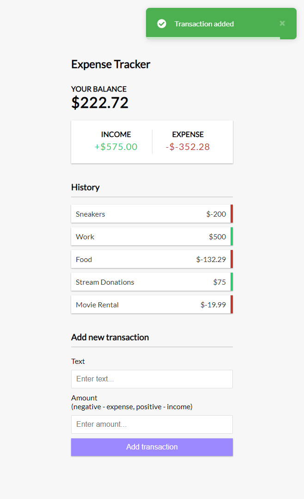

<<<<<<< HEAD
# Vue 3 Expense Tracker

An expense tracker app built with Vue 3 and the composition API.



## Project Setup

```sh
npm install
```

### Compile and Hot-Reload for Development

```sh
npm run dev
```

### Compile and Minify for Production

```sh
npm run build
```

 
